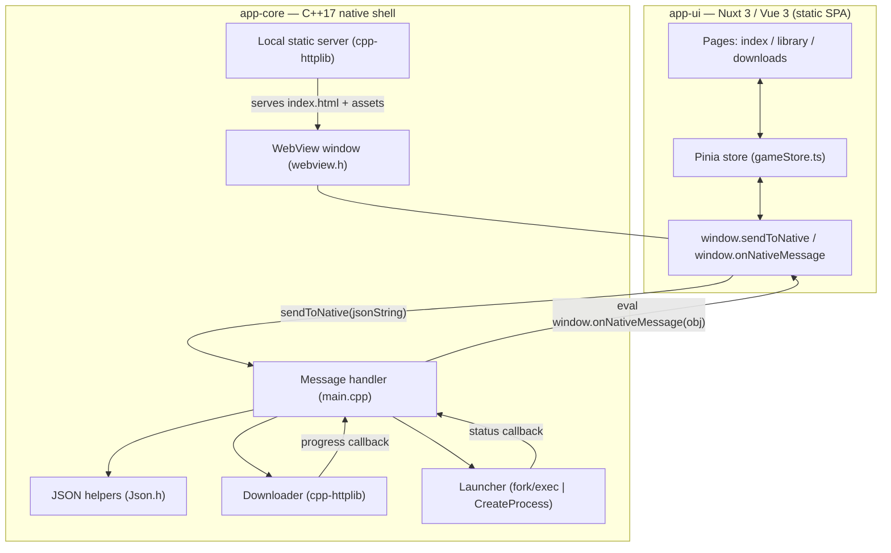

# Steam Clone — Architecture

A cross-platform desktop game launcher built as a **C++17 native shell** hosting
a **Nuxt 3 (Vue 3) web UI** inside a system WebView. The native layer owns
OS-level concerns (windowing, downloads, process launching, filesystem); the web
layer owns all presentation and interaction. The two communicate over a small,
JSON message-passing bridge.

> This document describes the code as it actually is. When in doubt, the source
> in `app-core/` and `app-ui/` is authoritative.

---

## 1. High-level overview



Runtime flow:

1. `app-core` starts, creates the WebView window.
2. It locates the built UI (`./ui/index.html`, copied next to the binary) and
   serves that directory over a **local `127.0.0.1` HTTP server** (cpp-httplib)
   on a random free port, then navigates the WebView to it. Serving over HTTP
   (rather than `file://`) avoids browser origin/asset-loading restrictions.
3. The Vue app boots, registers `window.onNativeMessage`, loads the game catalog,
   and asks the backend to scan the library.
4. User actions dispatch JSON commands to C++ via `window.sendToNative`.
5. Background work (downloads, launched processes) reports back by `eval`-ing
   `window.onNativeMessage(...)` on the UI thread.

---

## 2. Backend — `app-core` (C++17)

| File | Responsibility |
|------|----------------|
| `src/main.cpp` | App entry, WebView setup, bridge wiring, local static server, message routing, progress/status → UI |
| `src/Downloader.cpp` / `include/Downloader.h` | Threaded HTTP download with pause / resume / cancel, resumable range requests, progress callbacks |
| `src/Launcher.cpp` / `include/Launcher.h` | Launch a game executable and monitor it on a worker thread; report launching / playing / exited / error |
| `include/Json.h` | Dependency-free `SimpleJSON` (builder) and `SimpleJSONParser` (reader) for the bridge protocol |
| `src/Info.plist` | macOS app-bundle metadata |
| `CMakeLists.txt` | Build config; fetches `cpp-httplib` and `webview`; copies the built UI to `build/ui` |

### 2.1 Message handler (`main.cpp`)
- Binds `sendToNative` so JS can hand the backend a JSON string.
- `handleMessage()` parses the message and dispatches on `action`.
- `pushNativeMessage()` serializes a `SimpleJSON` object and pushes it to the UI
  by evaluating `window.onNativeMessage(...)`.
- `evalFromThread()` marshals every UI `eval` back onto the WebView thread via
  `webview::dispatch`, so the worker threads in `Downloader`/`Launcher` can
  report progress safely.

### 2.2 Downloader
- Runs on a dedicated worker thread; one active download at a time.
- Parses the URL, issues a `HEAD` for total size, then a streaming `GET`.
- **Resume:** if a partial file exists, sends a `Range: bytes=<n>-` header and
  appends. **Pause:** the streaming callback blocks on a condition variable.
  **Cancel:** the callback returns `false` to abort the transfer.
- Emits `DownloadProgress` (percent, MB/s, ETA, bytes) through a callback.

### 2.3 Launcher
- Starts the executable with `fork`/`execl` (POSIX) or `CreateProcessW`
  (Windows); refuses to launch if a game is already running.
- A monitor thread `waitpid`s / `WaitForSingleObject`s the child and reports the
  exit code when it ends.

### 2.4 JSON helpers (`Json.h`)
The bridge protocol is a small set of **flat** messages, so a full JSON library
is unnecessary. `SimpleJSON` builds outgoing messages; `SimpleJSONParser` reads
the limited set of incoming ones (string / number / bool / one nested object).

> Note: `SimpleJSON` provides an explicit `const char*` overload. Without it,
> string literals would bind to the `bool` overload (a standard conversion),
> silently turning `set("event", "FOO")` into a boolean — see the comment in
> `Json.h`.

---

## 3. Frontend — `app-ui` (Nuxt 3 / Vue 3)

Configured for **static generation** (`ssr: false`, `nitro.preset: static`) so
the whole UI ships as static files the native shell can serve locally.

| Area | Files |
|------|-------|
| App shell | `app.vue` (title bar, sidebar, status bar, `<NuxtPage/>`; wires `window.onNativeMessage`) |
| Pages | `pages/index.vue` (Store), `pages/library.vue`, `pages/downloads.vue` |
| Components | `GameCard`, `GameDetail`, `LibraryGameView`, `DownloadBar`, `DownloadItem`, `StatusBadge`, `ActionButton`, `AppSidebar`, `AppStatusBar`, `NavItem` |
| State | `stores/gameStore.ts` (Pinia) — game list, per-game state, bridge actions, native-event handling |
| Data | `data/catalog.ts` — sample game catalog |
| Styling | Tailwind CSS (`tailwind.config.ts`) with a Steam-inspired palette |

The Pinia store is the single point of contact with the bridge:
`startDownload`, `pauseDownload`, `resumeDownload`, `launchGame`,
`checkInstalled` send commands; `handleNativeMessage` applies incoming events to
reactive state; `sendToNative` serializes and forwards to the native binding.

---

## 4. The bridge (IPC protocol)

JSON messages flow both ways. The native binding `sendToNative` is injected by
the WebView; the backend pushes events by evaluating `window.onNativeMessage`.

### 4.1 JS → C++ (actions)
Envelope: `{ "action": <ACTION>, "gameId": <id>, "payload": { ... } }`

| Action | Payload | Effect |
|--------|---------|--------|
| `START_DOWNLOAD` | `url`, `targetDirectory` | Begin a download |
| `PAUSE_DOWNLOAD` | — | Pause the active download |
| `RESUME_DOWNLOAD` | — | Resume a paused download |
| `CANCEL_DOWNLOAD` | — | Cancel the active download |
| `LAUNCH_GAME` | `executablePath`, `workingDirectory` | Launch and monitor a game |
| `CHECK_INSTALLED` | `directory`, `executableName` | Check whether an executable exists |
| `SCAN_LIBRARY` | `baseDirectory` | List installed game directories |

### 4.2 C++ → JS (events)
Envelope: `{ "event": <EVENT>, "gameId": <id>, "data": { ... } }`

| Event | `data` highlights |
|-------|-------------------|
| `DOWNLOAD_PROGRESS_UPDATE` | `status`, `progressPercentage`, `downloadSpeed`, `estimatedTimeArrival`, `bytesDownloaded`, `totalBytes` |
| `DOWNLOAD_ERROR` | `status`, `message` |
| `GAME_EXECUTION_STATUS` | `status`, `exitCode`, `errorMessage?` |
| `INSTALL_STATUS` | `installed`, `status` |
| `LIBRARY_SCAN_RESULT` | `games[]`, `baseDir` |

`status` values align with the store's `GameStatus`: `idle`, `downloading`,
`paused`, `installed`, `launching`, `playing`, `error`.

---

## 5. Build & packaging

```
./build.sh [Release|Debug]
```

1. **UI:** `npm install` (first run) then `npm run generate` →
   `app-ui/.output/public`.
2. **Core:** CMake configures `app-core`, fetches `cpp-httplib` (v0.15.3) and
   `webview` (0.12.0), and builds `SteamClone`.
3. A post-build step copies `app-ui/.output/public` → `build/ui`, so the binary
   finds the UI at `./ui/index.html` (with a dev fallback to
   `../app-ui/.output/public`).

Dependencies are fetched at configure time via CMake `FetchContent`; nothing is
vendored into the repo.

---

## 6. Cross-platform notes

| Platform | WebView backend | Notes |
|----------|-----------------|-------|
| macOS | WebKit | Built as an `.app` bundle (`Info.plist`), Objective-C++ (`OBJCXX`); executable path via `_NSGetExecutablePath`; Cocoa `NSApplication` activation. |
| Linux | WebKitGTK | Requires `gtk+-3.0` and `webkit2gtk-4.1`; executable path via `/proc/self/exe`. |
| Windows | WebView2 (Edge) | Links `ole32 shell32 shlwapi`; `WIN32_EXECUTABLE` in Release; executable path via `GetModuleFileNameW`. |

---

## 7. Repository layout

```
cpp-app/
├── ARCHITECTURE.md          ← this document
├── README.md                ← quick start
├── build.sh                 ← UI + core build script
├── app-core/                ← C++17 native shell
│   ├── CMakeLists.txt
│   ├── include/             ← Downloader.h, Launcher.h, Json.h
│   └── src/                 ← main.cpp, Downloader.cpp, Launcher.cpp, Info.plist
└── app-ui/                  ← Nuxt 3 / Vue 3 frontend
    ├── app.vue, nuxt.config.ts, tailwind.config.ts
    ├── pages/  components/  stores/  data/  public/
```

---

## 8. Known limitations / future work

- **Single concurrent download.** The `Downloader` handles one transfer at a
  time; a real launcher would queue or parallelize.
- **`baseInstallDir` defaults to a Windows path** (`C:/SteamCloneGames`) in the
  store; per-OS defaults would be an improvement.
- **Catalog is static** (`data/catalog.ts`) — no real store backend.
- **`SimpleJSONParser` is intentionally minimal** (flat messages only). If the
  protocol grows to need arrays-of-objects or escaped string contents inbound,
  switch to a full JSON parser.
- **No automated tests** around the bridge protocol yet.
